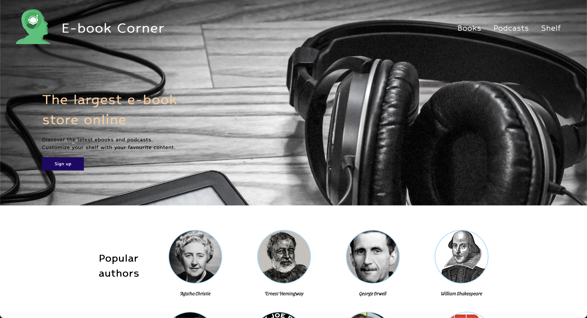

# [Landing page](https://github.com/leulyk/book-store/blob/main/README.md)

> This is a landing page for an e-book and podcast hosting web site. I used HTML and CSS only for development.

> ### [See the live preview here.](https://leulyk.github.io/ebook-store-landing-page/)

### Resources used from the internet

- [Logo image from Pixabay](https://pixabay.com/illustrations/icon-head-profile-headphones-1243679/)
- [Icon image from VectorStock](https://www.vectorstock.com/royalty-free-vector/ebook-icon-vector-4026560)
- [Ebook and headphone image from Pixabay](https://pixabay.com/photos/ebook-headphone-relax-leisure-cozy-5066154/)
- Pictures of authors from [Pixabay](https://pixabay.com)
- Pictures of podcasts from [Google images](images.google.com)

## Author

<a href="https://linkedin.com/in/leul-yiheyis-a165a394" target="blank">Leul Yiheyis</a>
